# GT\-M601柔性温度传感器模块手册

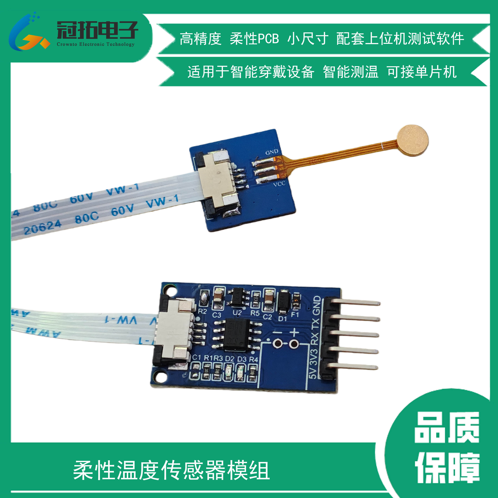

# 一、产品介绍

M601是高精度数字模拟混合信号温度传感芯片，最高测温精度±0\.1℃，用户无需进行校准。温度芯片感温原理基于CMOS 半导体PN节温度与带隙电压的特性关系，经过小信号放大、模数转换、数字校准补偿后，数字总线输出，具有精度高、一致性好、测温快、功耗低、可编程配置灵活、寿命长等优点。温度芯片内置16\-bit ADC，分辨率0\.004°C，具有\-70°C 到\+150°的超宽工作范围。

采集模块内部集成单片机，直接与传感器单总线通讯并通过串口通讯输出温度测量值，使用方便，可用于智能穿戴、电子体温计等。

# 二、 传感器技术参数

## 2\.1 产品尺寸参数

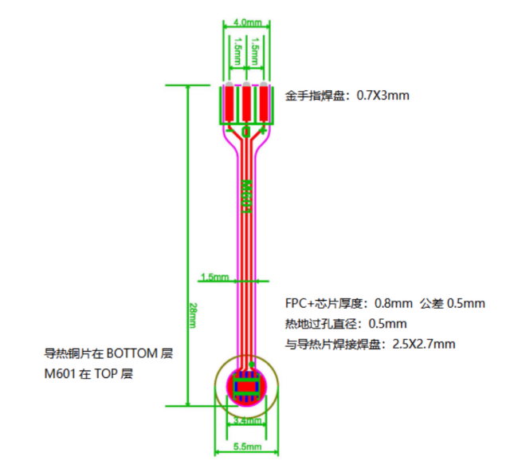

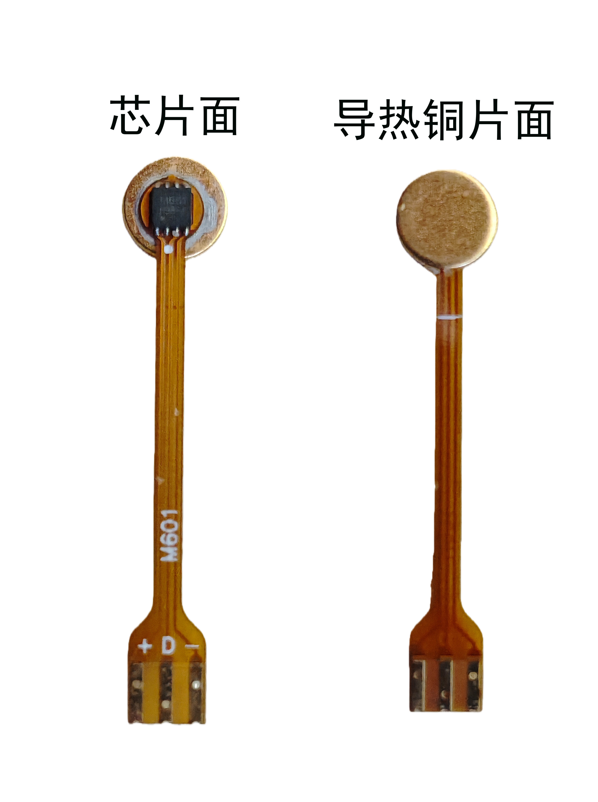

## 2\.2 测温性能指标

±0\.1℃@\+28°C to \+43°C,

±0\.5℃@\-10℃ to\+28°C\&\+43°Cto \+60℃

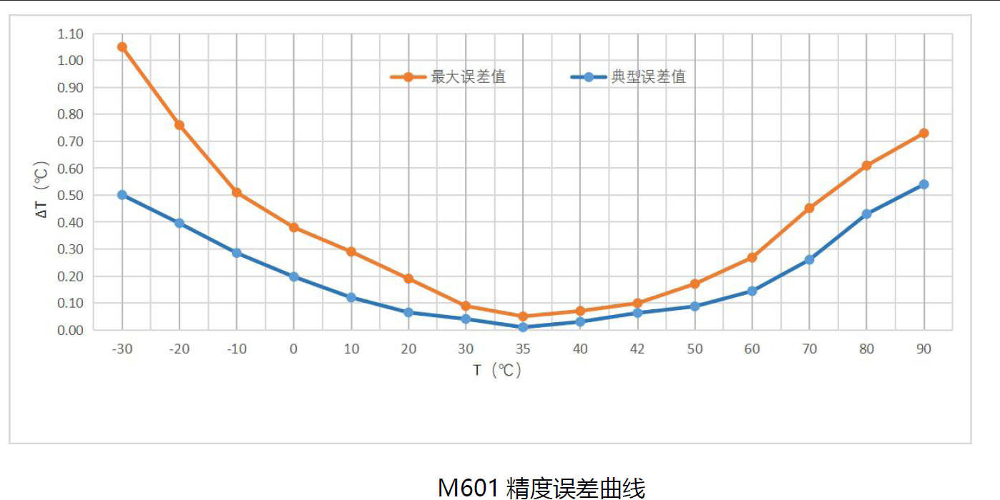

## 2\.3 电气规格

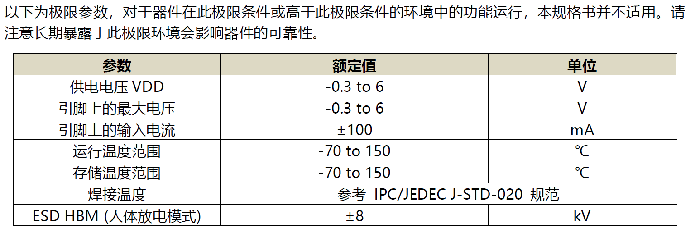

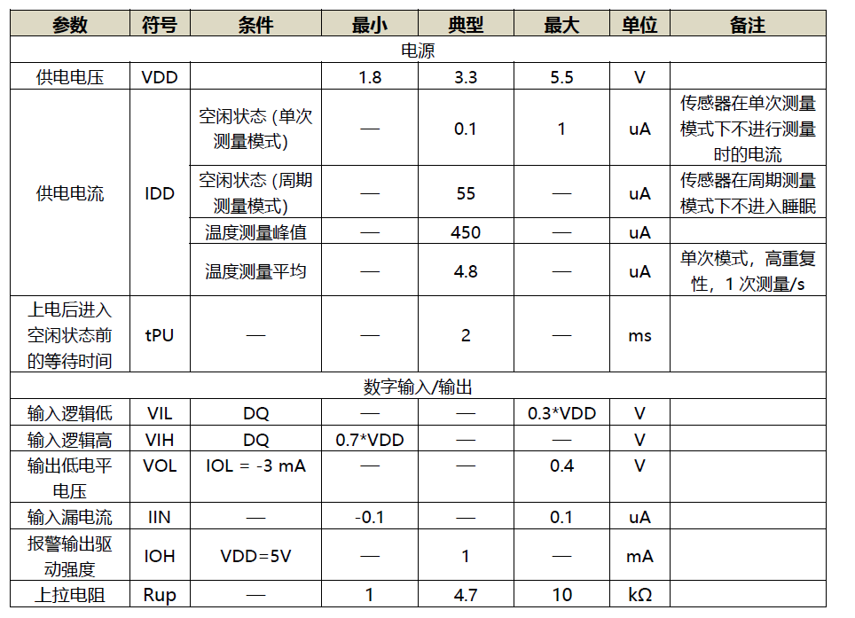

## 2\.4 传感器单总线通讯说明

此处详见《M601 M1601 M1820高精度温度芯片产品手册》。

# 三、 采集模块技术参数

## 3\.1 模块介绍

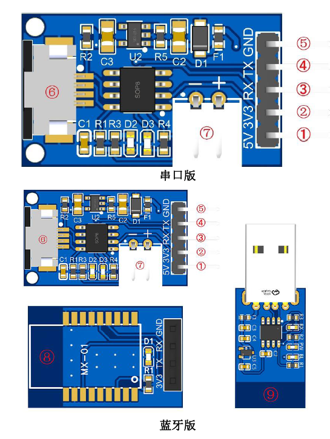

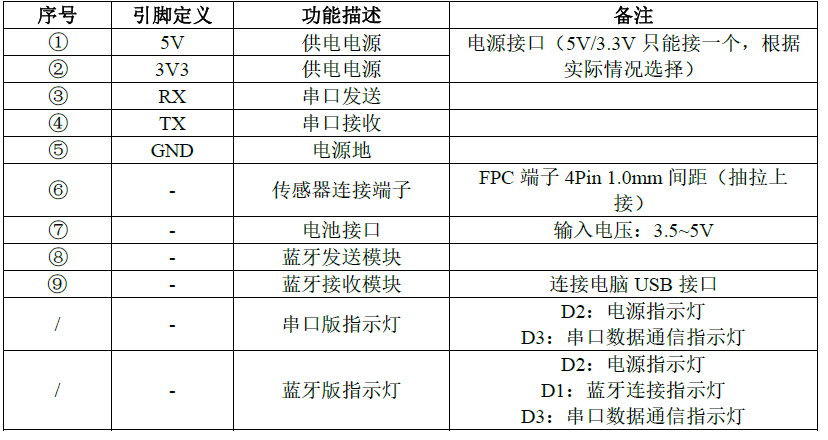

## 3\.2 模块尺寸

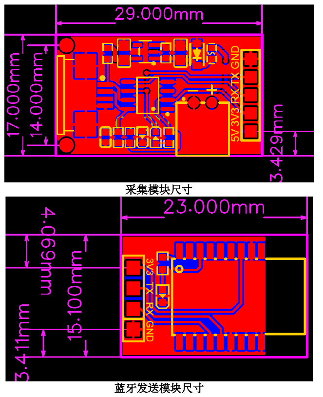

## 3\.3 接线方式

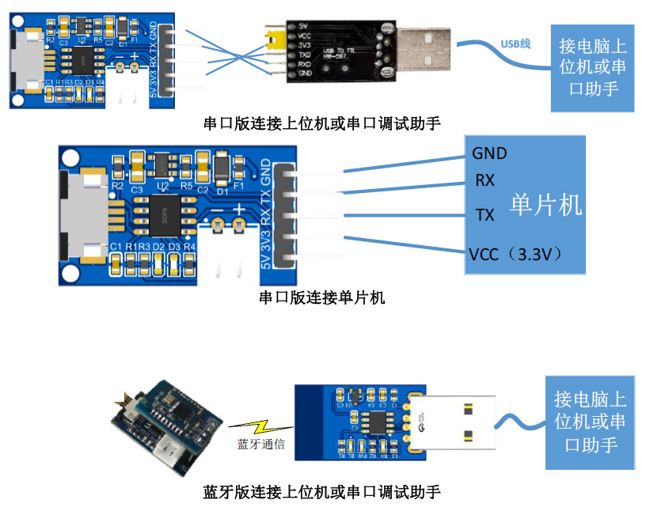

传感器与模块连接方式：转接端子为抽拉上接式，先抽出黑色部分，然后排线金属面向上插入，然后再将黑色部分推回，压紧即可。

## 3\.4 通讯协议

波特率：115200 ；

停止位：1；数据位：8；奇偶校验：无；

（1）数据定时主动上报，字符串输出，数据包格式:“A\+XX\.XB\\r\\n”

|1|2|3|4|5|6|7|8|9|
|---|---|---|---|---|---|---|---|---|
|A|\+/\-|X|X|\.|X|B|\\r|\\n|

说明：

1\. 第1位是固定字符“A”；

2\. 第2位代表温度正负；

3\. 第3至6位字符串代表温度数值字符串；

4\. 第7位是固定字符“B”；

5\. 第8、9位"\\r\\n"表示回车换行。

# 四、上位机使用方法

## 4\.1 PC端上位机（windows）

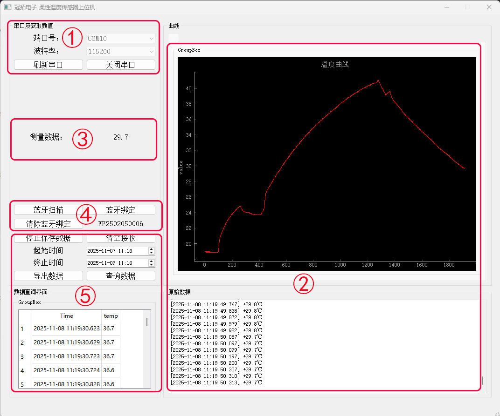

|序号|功能区|功能说明|
|---|---|---|
|①|串口设置区|选择对应串口号，打开/关闭串口（串口号由电脑端口决定，非固定统一，打开电脑设备管理器查看端口，带有CH340字样的端口号为正确端口）|
|②|温度曲线及原始数据|显示采集模块发送的数据，同时显示当前最近10000个数据点的温度曲线图|
|③|当前温度显示|显示当前测量温度值|
|④|蓝牙设定区|蓝牙配对用，出厂已做过配对，无需点击； 当蓝牙配对失效时，先点击“清除蓝牙绑定”，再次点击“蓝牙扫描”，在“蓝牙绑定”下方出现12位的蓝牙号，代表搜索成功，此时点击“蓝牙绑定”即可完成配对。|
|⑤|数据存储导出区|选择是否开启数据保存模式，选择相应的时间段，可以做数据查询及数据导出操作|

## 4\.2 手机端APP（安卓）

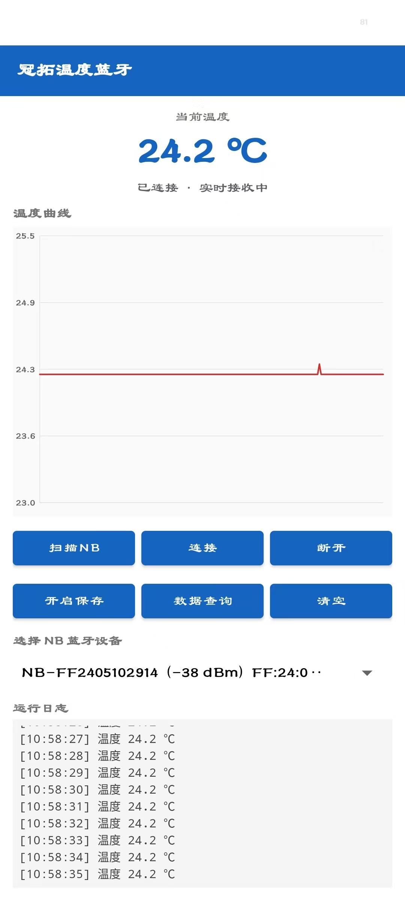

从上到下依次是当前温度值，温度曲线，扫描设置按键，蓝牙设备列表，原始接收数据。

首次打开APP后，要打开相应权限。先点击【扫描NB】，下方列表出现NB设备号之后，点击【连接】，即可正常与采集设备通讯。点击【开启保存】之后的测量数据会保存在手机中，点击【清空】会清除当前界面数据，保存的数据不会被情况。点击【数据查询】会跳转至如下界面。

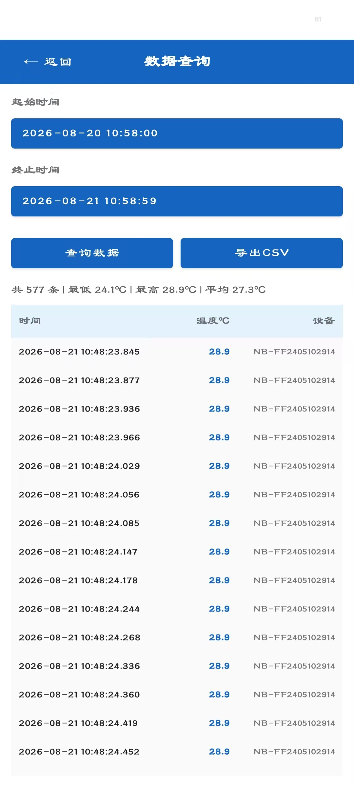

首先选择【起始时间】和【终止时间】，然后点查询数据，即可看到该时间段内保存的数据，之后点击【导出CSV】，会将相应的CSV文件保存在手机文件存储中。

