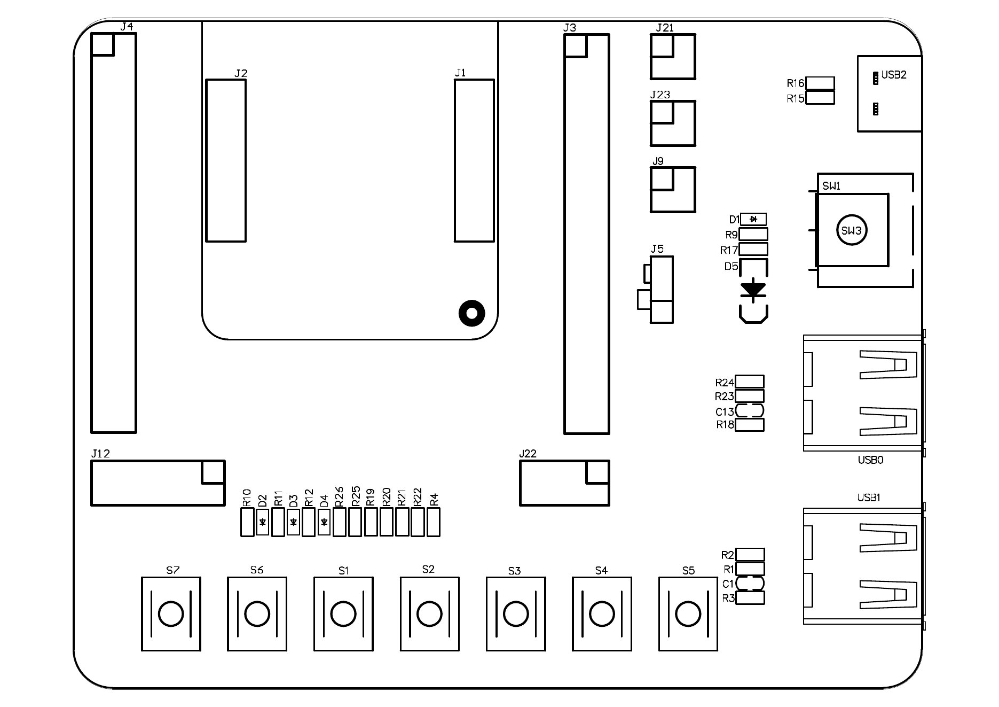

# AC632_DevKitBoard V2.0 板卡说明

## 资料对应关系

用户提供的图片介绍的是“杰理 AC6321A 开发板、DEMO 板、开发验证板”，其芯片属于 AC632N 系列。仓库中与 J12、三色 LED 和 IOKey 接口对应的是完整开发板 `AC632_DevKitBoard V2.0`，不是只带核心芯片和两组排针的 `AC6321A_TOP V2.0` 核心板。

| 资料或实物 | 结论 |
|---|---|
| `AC632_DevKitBoard V2.0` | 完整开发验证板，包含 USB、供电、复位、按键、LED 和 J12 接口。J12 位于该板。 |
| `AC6321A_TOP V2.0` | AC6321A 核心板，主要通过两组 2 x 9P 排针连接底板，仓库资料中没有 J12。 |
| 用户提供的图片 | 板卡产品介绍，不是操作指令；其中关于 AC6321A 系列、双排针、Type-C 供电/下载和无 DAC 的描述作为产品背景记录。 |

如果手里的实物只有芯片模块、两侧各一组 2 x 9P 排针，而找不到 `J12` 丝印，那么它更可能是 `AC6321A_TOP V2.0` 核心板；本说明中的 J12 位置只适用于完整的 `AC632_DevKitBoard V2.0`。

## J12 在哪里

从开发板器件面正面看，J12 在板子的左下区域：靠左侧边框的横向 6P 接口，位于左侧排针下方、LED 电阻/二极管区域的左侧，并在底部按键排的上方。位号图中接口旁边直接标有 `J12`。

原始资料：

- [AC632_DevKitBoard V2.0 位号图](<./AC632_DevKitBoard V2.0-位号图.pdf>)
- [AC632_DevKitBoard V2.0 贴片图](<./AC632_DevKitBoard V2.0-贴片图.pdf>)
- [AC632_DevKitBoard V2.0 原理图](<./AC632_DevKitBoard V2.0原理图.pdf>)

## J12 引脚定义

原理图中的 J12 是 `CON6` 接口。它把 LED 和按键信号引出，但这些信号默认不是直接固定连接到某一个 MCU GPIO；需要用跳线把 J12 信号接到 MCU 排针上的同名 GPIO。

| J12 脚位 | 信号 | 电气含义 | 当前 Rider 固件默认连接 |
|---:|---|---|---|
| 1 | ADKEY | AD 按键输入 | 不使用，不接 |
| 2 | IOKey2 | 低电平有效按键 | `PB1`，示例接 J1 pin 9 |
| 3 | IOKey1 | 低电平有效按键 | `PB0`，示例接 J1 pin 8 |
| 4 | LED1 | 红色 LED，高电平点亮 | `PB6`，示例接 J1 pin 14 |
| 5 | LED2 | 绿色 LED，高电平点亮 | `PB5`，示例接 J1 pin 13 |
| 6 | LED3 | 蓝色 LED，高电平点亮 | `PB4`，示例接 J1 pin 12 |

J1 只是当前资料采用的跳线示例；J3 等具有相同网络名称的 MCU 排针也可以使用，但应以排针旁的 GPIO 丝印和原理图网络名为准。不要把 J12 信号接到 `PB7`，也不要占用 `PA0`：当前 Rider 固件分别将它们保留给 M601 1-Wire 和 UART0 TX。

## 找不到 J12 时的替代接法

部分实物可能没有装配 J12，但仍能从 LED2 的信号焊盘或测试点引线。此时不要把任意 `PB1-PB9` 直接试接到 LED 引脚，先选择一个与固件语义一致的 GPIO：

| 跳线 | 物理 LED2 的显示内容 | 是否需要改代码 |
|---|---|---|
| `PB6 -> LED2` 信号端 | 按逻辑 LED1 显示 BLE 状态：广播慢闪、连接常亮 | 不需要，当前 `LED1=PB6` |
| `PB5 -> LED2` 信号端 | 按逻辑 LED2 显示 M601 状态：有效常亮、无设备快闪 | 不需要，当前 `LED2=PB5` |
| 其他可用 PB GPIO | 取决于你把它配置为 LED1、LED2 或 LED3 | 需要修改 `RIDER_BOARD_DIAG_LED*_PORT` |

LED2 信号应接到原理图中 `LED2` 网络的信号侧，并保留板上的 `R11=510R` 限流电阻；不要短接 LED 阴极或直接绕过限流电阻。仍然禁止占用 `PB7` 和 `PA0`。如果只使用这一颗物理 LED，建议把未接出的其他 LED 配置为 `NO_CONFIG_PORT`，避免它们被当作已连接的诊断输出。

## 当前固件如何使用 J12

当前配置位于 [`board_ac632n_rider_cfg.h`](../../../../apps/rider_core_temp/board/bd19/board_ac632n_rider_cfg.h)；对应的诊断逻辑位于 [`rider_board_diag.c`](../../../../apps/rider_core_temp/modules/diag/rider_board_diag.c)。默认行为如下：

| 信号 | 固件行为 |
|---|---|
| LED1 红 | BLE 未启动熄灭，广播时慢闪，连接后常亮 |
| LED2 绿 | M601 快照有效时常亮，未检测到器件时快闪 |
| LED3 蓝 | CRC/范围/未佩戴错误提示，IOKey2 状态打印时短暂闪烁 |
| IOKey1 | 依次点亮三色 LED，执行约 1.2 秒 LED 自检 |
| IOKey2 | 通过串口输出一次 BLE 和温度状态快照 |

LED 诊断由应用层定时器驱动，不使用 SDK 的通用 PWM LED 模式。板级进入低功耗或 BLE 退出时，诊断模块会关闭 LED 并释放 GPIO。

## 板卡能力摘要

以下信息综合用户提供的介绍、仓库原理图和位号图；其中具体引脚和 LED 网络以仓库原理图为准：

- MCU：AC6321A，QFN32，属于 AC632N 系列。
- GPIO：主要 IO 通过多组排针引出，便于测量和连接外部电路。
- USB：板上提供 Type-C/USB 接口，支持供电以及配套下载/调试路径；实际烧录仍需使用匹配的杰理工具链或下载器。
- 电源：原理图标出了 `DC5V`、`DCIN`、`VBAT0`、`LDOIN0` 和 `VDDIO` 等网络，并带有电源开关、复位和 USB 供电路径。
- 指示灯：LED1/LED2/LED3 分别为红/绿/蓝，LED 串联 `510R` 限流电阻后接到 J12 的对应信号。
- 按键：板上有 ADKEY/IOKEY 按键网络，J12 额外把 IOKey1/IOKey2 引出。
- 音频：用户介绍指出 AC6321A 无 DAC 输出；当前 Rider 固件也不启用音频产品路径。

## 上电和排查顺序

1. 确认实物是带 `J12` 丝印的 `AC632_DevKitBoard V2.0`，不是 `AC6321A_TOP V2.0` 核心板。
2. 将 J12 pin 4 接到 `PB6`，并确认 LED1 的地线和限流路径已经在板上存在；其他 LED/按键按上表连接。
3. 烧录 `ac632n_rider_core_temp` 后等待 BLE 初始化：广播期间 LED1 慢闪，连接后 LED1 常亮。
4. LED1 不亮时，依次检查 J12 pin 4、跳线另一端的 `PB6`、LED1 高电平有效配置，以及是否误接到被 PB7/PA0 保留的 GPIO。

## 相关项目资料

- [Rider CoreTemp 模块说明](../../../../apps/rider_core_temp/README.md)
- [AC6321A_TOP V2.0 IO 功能列表](<./AC6321A_TOP V2.0 IO功能列表.pdf>)
- [AC6321A_TOP V2.0 原理图](<./AC6321A_TOP V2.0原理图.pdf>)
- [AC632N 开发板用户手册](<../AC632N用户手册开源版本V1.0.pdf>)
